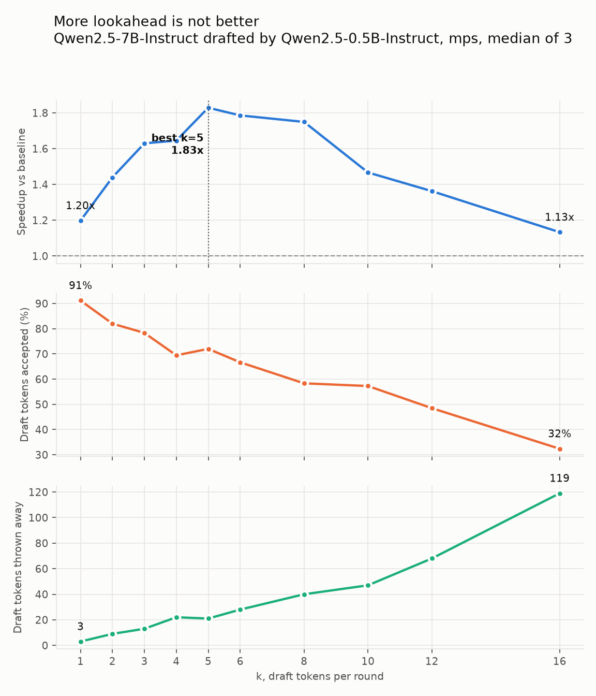
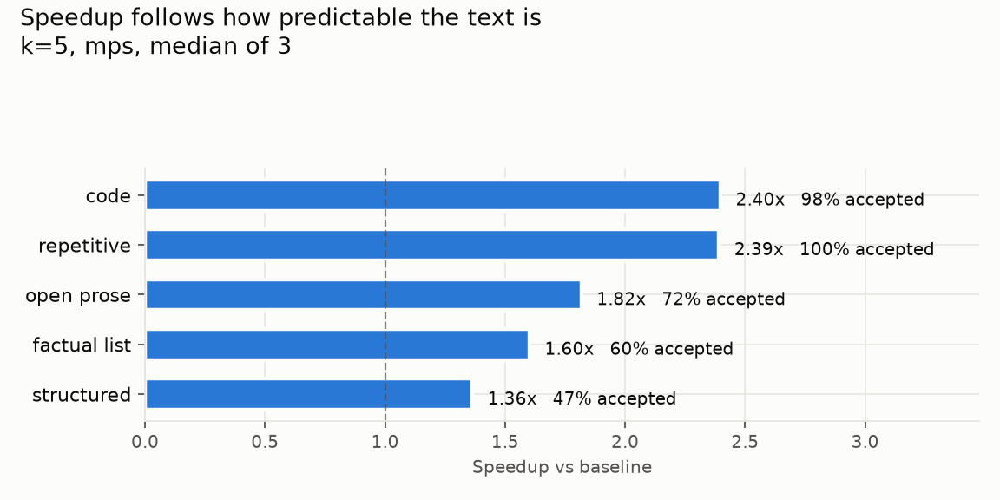

# LLM Inference Experiments

Scripts behind the LLM Inference essays on adimyth.in. Every figure quoted in those essays is produced by running these.

## Setup

```bash
uv venv --python 3.12 --python-preference only-managed
uv pip install -r requirements.txt
```

`--python-preference only-managed` matters on Apple Silicon. A universal `python3` from python.org resolves to its x86_64 slice, and torch ships no Intel macOS wheels, so the install fails on a wheel-availability error that does not mention architecture.

## KV Caching

### kv_cache_size.py

```bash
.venv/bin/python kv_cache_size.py
```

Arithmetic only. No model is loaded and nothing is downloaded. It evaluates

```
2 * layers * kv_heads * head_dim * seq_len * batch * dtype_bytes
```

against published config values for three architectures, then derives the concurrency ceiling for a given amount of free VRAM. The leading 2 is one tensor for K and one for V. Edit `MODELS` and `HEADROOM_GB` to change it.

Output, fp16, one sequence, at each model's published context limit:

| Model      | Attention                 | Context | Cache   |
| ---------- | ------------------------- | ------- | ------- |
| Llama-2-7B | multi-head, 32 KV heads   | 4K      | 2.00 GB |
| Llama-3-8B | grouped-query, 8 KV heads | 8K      | 1.00 GB |
| Mistral-7B | grouped-query, 8 KV heads | 32K     | 4.00 GB |

### kv_cache_timing.py

```bash
.venv/bin/python kv_cache_timing.py
```

Generates with `use_cache=True` and `use_cache=False` back to back and reports the median of 3 runs per cell. Downloads GPT-2 (~526MB) on first run.

Fixed at GPT-2 124M, fp32, CPU, 64-token prompt, greedy decoding, one warm-up pass before timing. CPU rather than MPS so the comparison is not distorted by accelerator scheduling.

Measured on MacBook Pro, Apple M4 Pro (8P+4E), 48GB, macOS 15.7.5, torch 2.13.0, transformers 5.15.1:

| New tokens | No cache | Cache | Speedup |
| ---------- | -------- | ----- | ------- |
| 32         | 0.94s    | 0.24s | 4.0x    |
| 64         | 2.12s    | 0.45s | 4.7x    |
| 128        | 5.12s    | 0.90s | 5.7x    |
| 256        | 14.99s   | 1.84s | 8.2x    |
| 512        | 50.61s   | 3.96s | 12.8x   |

The speedup column grows because the uncached path is quadratic in output length and the cached path is linear. Per doubling, uncached time grows 2.3x, 2.4x, 2.9x, 3.4x; cached grows 1.9x, 2.0x, 2.0x, 2.2x.

Absolute times are small-model-on-CPU figures and will differ on other hardware. The shape will not.

### kv_cache_measured.py

```bash
.venv/bin/python kv_cache_measured.py
```

Reads the actual K and V tensors the model retains during generation and checks them against `kv_cache_size.py`. Confirms the formula used to size a fleet is the arithmetic the runtime performs.

GPT-2, fp32, 64-token prompt:

| seq_len | Measured | Formula  | Ratio |
| ------- | -------- | -------- | ----- |
| 64      | 4.50 MB  | 4.50 MB  | 1.000 |
| 128     | 9.00 MB  | 9.00 MB  | 1.000 |
| 320     | 22.50 MB | 22.50 MB | 1.000 |
| 576     | 40.50 MB | 40.50 MB | 1.000 |

Exact at every checkpoint, and flat at 0.0703 MB per token. `seq_len` is prompt plus tokens generated so far, which is what the cache holds.

## Speculative Decoding

`spec_decode.py` `spec_bench.py` `spec_sweep.py` `spec_precondition.py` `spec_plot.py`

A small draft model guesses several tokens ahead; the large target model checks all
of them in one forward pass and keeps the longest prefix it agrees with. Rejected
guesses are compute you paid for and deleted, which is what these scripts measure.

```bash
.venv/bin/python spec_bench.py       # k sweep + workload sweep -> results/results.json
.venv/bin/python spec_plot.py        # charts from that json
.venv/bin/python spec_decode.py -k 5 # single comparison
```

Setup: Qwen/Qwen2.5-7B-Instruct drafted by Qwen/Qwen2.5-0.5B-Instruct, mps, float16,
64 tokens, median of 3 runs, greedy.
Apple M4 Pro, torch 2.13.0.

**Correctness:** greedy speculative output is asserted token-identical to greedy
baseline on every run. With draft and target set to the same model, acceptance is
100% and nothing is discarded.

### Lookahead sweep

Baseline 15.75 tok/s, 64 target passes.

| k | Speedup | Accepted | Discarded | Target passes | Draft passes |
| --- | --- | --- | --- | --- | --- |
| 1 | 1.20x | 91.2% | 3 | 34 | 68 |
| 2 | 1.44x | 82.0% | 9 | 25 | 75 |
| 3 | 1.63x | 78.3% | 13 | 20 | 80 |
| 4 | 1.64x | 69.4% | 22 | 18 | 90 |
| 5 | 1.83x | 72.0% | 21 | 15 | 90 |
| 6 | 1.79x | 66.7% | 28 | 14 | 98 |
| 8 | 1.75x | 58.3% | 40 | 12 | 108 |
| 10 | 1.47x | 57.3% | 47 | 11 | 121 |
| 12 | 1.36x | 48.5% | 68 | 11 | 143 |
| 16 | 1.13x | 32.4% | 119 | 11 | 187 |



Speedup peaks at k=5 (1.83x) and falls away after. Target passes
bottom out around 11 while draft passes keep climbing, so past the peak you are
buying waste rather than speed. Discarded tokens go from 3 to 119.

### Workload sweep

Acceptance is how often the draft guesses what the target would have said, so it
depends on how predictable the text is. Prompts are in `workloads.py`.

| Workload | Speedup | Accepted | Discarded |
| --- | --- | --- | --- |
| code | 2.40x | 98.2% | 1 |
| repetitive | 2.39x | 100.0% | 0 |
| open prose | 1.82x | 72.0% | 21 |
| factual list | 1.60x | 60.0% | 34 |
| structured | 1.36x | 47.0% | 53 |



Code is the fastest real case at 2.40x, because syntax makes the next
token largely forced and a 0.5B draft gets it right 98% of the time.

### Memory

| Stage | MPS allocated (GB) | MPS driver (GB) | System available (GB) | Swap (GB) |
| --- | --- | --- | --- | --- |
| before load | 0.00 | 0.00 | 30.3 | 2.21 |
| target loaded | 14.19 | 15.04 | 9.3 | 2.21 |
| both loaded | 15.11 | 15.14 | 15.8 | 2.21 |
| after run | 15.11 | 15.33 | 14.4 | 2.21 |

Swap never moved, so none of these timings are contaminated by paging.

### The precondition

Cost of one forward pass against how many tokens it verifies. Speculative decoding
only pays if checking k tokens costs about what checking one costs.

On MPS that holds: k=4 costs 1.04x of k=1. On CPU it does not, k=4 costs 3.63x,
which is why this is a GPU technique.

## Method notes

- Every timed region calls `torch.mps.synchronize()` before stopping the clock.
  MPS queues work asynchronously; without it you time how fast Python queued the
  work, not how long it took.
- Models are warmed before timing. The first forward pass pays lazy initialisation
  and will otherwise land in the measurement.
- Cells are medians of repeated runs. Single runs produced non-monotonic acceptance,
  which was measurement noise rather than a finding.
- Charts render light and dark separately rather than inverting one image.
